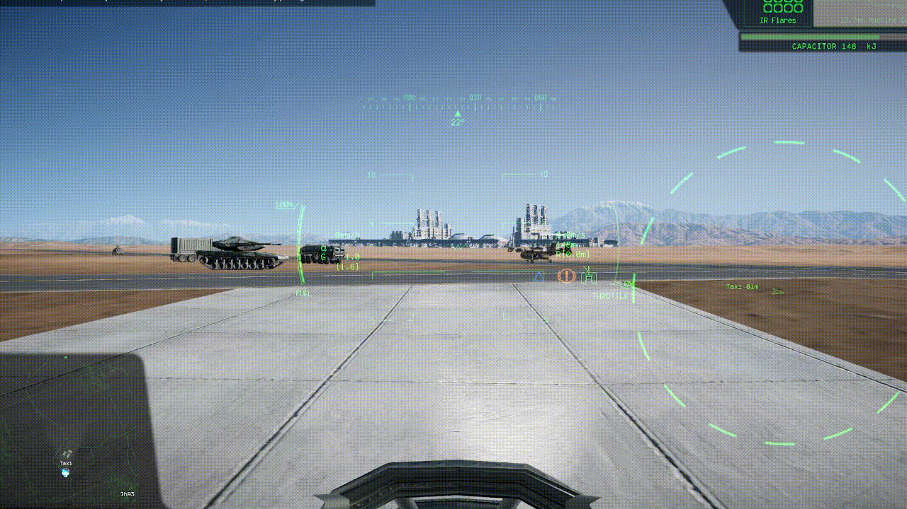

# CustomOrbit for Nuclear Option

**A client-side mod that customizes the Orbit camera anchor position in Nuclear Option.**

 

>[!NOTE]
>ignore the hud, that's from another mod called [ThirdPersonHUD](https://github.com/OverlordMIke/Nuclear-Option-Mod-ThirdPersonHUD). do check that mod out if you are planing on using this to get that war lighting cam vibe

## About

This mod lets you adjust the **Orbit camera** anchor point so the external view sits exactly where you want it — closer, further, higher, or offset to the side.

By default it repositions the orbit camera to a chase-style anchor with configurable X/Y/Z offsets and distance, giving you a more cinematic third-person feel without switching to Chase mode.

Once installed, the mod is **enabled by default**. You can tweak all values via the auto-generated config file.

## Features

- **Custom orbit anchor position** — Move the orbit camera pivot point with per-axis X/Y/Z offsets.
- **Configurable distance** — Set your preferred orbit distance from the anchor point.
- **Hot-configurable** — All settings are in the BepInEx config file and take effect without restarting.

## Configuration

After first launch, a config file is generated at:
```
BepInEx/config/com.onixldlc.customorbit.cfg
```

| Setting | Default | Description |
|---------|---------|-------------|
| `Enabled` | `true` | Master toggle for the mod |
| `AnchorOffsetX` | `0` | Left/right offset |
| `AnchorOffsetY` | `2.2` | Up/down offset |
| `AnchorOffsetZ` | `2` | Forward/back offset (negative = behind) |
| `OrbitDistance` | `10` | Distance from anchor to camera |

## Requirements

- [Nuclear Option](https://store.steampowered.com/app/2168680/Nuclear_Option/) (Steam)
- [BepInEx](https://github.com/BepInEx/BepInEx/releases) (latest pack for Unity Mono games — usually drop the BepInEx folder into your game directory)

## Installation

1. Install **BepInEx** if you haven't already:
   - Download the appropriate pack from the [BepInEx GitHub releases](https://github.com/BepInEx/BepInEx/releases).
   - Extract it so `BepInEx` folder is directly inside your Nuclear Option install directory (e.g. `C:\Program Files (x86)\Steam\steamapps\common\Nuclear Option\`).
   - Launch the game once — BepInEx will generate its folders.

2. Download the latest release of this mod from the [Releases page](https://github.com/onixldlc/NO-CustomOrbit/releases).

3. Extract the contents of the zip file into the `BepInEx/plugins` folder.

## Disclaimer

> [!CAUTION]
> While moving your orbit camera 2 units higher won't give you any advantage, do check if the server allows mods such as this!. since using it might get you kicked, banned, or penalized on a public server. So do **use it at your own risk!**

> [!NOTE]
> Now this is a **Client-side** only mod. And ngl i'm not sure how this might get you banned since all it does is allows you to modify the center of the orbit position. not really something that are "cheaty" in my opinion but because there are plenty of mod that says that installing their mods might get you banned from a public server, well i might as well put the warning here
